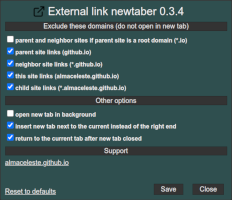
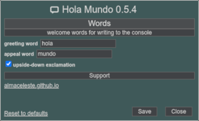

### about
this is the repo of my userscripts. I use some external libraries ([jQuery](https://jquery.com/), [arrive.js](https://github.com/uzairfarooq/arrive), [GM_config](https://github.com/sizzlemctwizzle/GM_config/wiki)) in my userscripts. 

#### license  

#### wiki
[How to install userscripts](https://github.com/almaceleste/userscripts/wiki/How-to-install-userscripts)  
[How to setup Tampermonkey dashboard custom style](https://github.com/almaceleste/userscripts/wiki/How-to-setup-Tampermonkey-dashboard-custom-style)

#### platform
  
  
  
  
  
  
  

#### external repos
  
  

### list of scripts 
#### [ Youtube Player Always On Top](https://github.com/almaceleste/userscripts/raw/master/src/Youtube_Player_Always_On_Top.user.js 'install')  
   
makes the youtube player visible while scrolling - minimizes the player box from a large box in the center to a small box in the upper left corner and allows you to read comments and watch video at the same time 

**features**
* makes the player smaller/bigger when you scroll page down/up
* you could use the minimize/maximize button in the upper right corner of the player for the same result
* use settings to choose what will be on top, minimized box' size, border and background.  

**known issue**
* ~~does not work when you open video from the youtube channel in the same tab~~
* when minimized, the progress bar displays the correct visible info, but when you hover over it shows the wrong time and a tooltip preview and when you click it moves to the this position rather than the expected one (this is the reason for youtube's deep code, and I don't know how to fix this yet)  

#### [ Watch Transition](https://github.com/almaceleste/userscripts/raw/master/src/Watch_Transition.user.js 'install')  
   
some modern sites, like Youtube and others, use ajax transitions for inner-site navigation as opposed to regular navigation. it makes difficult to write scripts which are related to the site url.  
this script watches for a transition event and prints it to the console 

**features**
* use settings to choose what kind of events to watch, the method of logging events, font style, color and background.  

#### [ OpenUserCSS Tweaks](https://github.com/almaceleste/userscripts/raw/master/src/OpenUserCSS_Tweaks.user.js 'install')  
    
some useful tweaks, that make working with the OpenUserCSS.org more convenient 

**features**
* displays version information for the themes on the profile page
* restores the images, that have been cropped by site, since they do not fit in the image container, and resizes the container for more accurate placement.  
    another advantage: these images support image zoom extensions
* changes the view to a more compact
* highlights the themes on hover
* on the profile page: displays statistics by default, adds screenshots of themes, adds an edit button to go to the edit page directly from the profile page
* on the edit page: removes variables (cause they is buggy now), makes the header (with save button) always available (sticky position)
* changes the start page to the search page cause the start page often throws an error
* use settings to enable/disable these options.  

#### [ Trello card details](https://github.com/almaceleste/userscripts/raw/master/src/Trello_card_details.user.js 'install')  
  
adds the creation date and the creator name and account link to the Trello card (works on the [Trello](https://trello.com) site)  
* use settings to choose which information to show.  

#### [ StackExchange link newtaber](https://github.com/almaceleste/userscripts/raw/master/src/StackExchange_link_newtaber.user.js 'install')  
opens links from posts and answers in the new tab instead of annoying in-place opening without `<Ctrl>` button or anything else just in ordinary way (works on the [StackExchange communities](https://stackexchange.org) sites)  
* this script should work in all StackExchange communities sites.  
* use settings to choose which links will be affected.  

#### [ Gnome Extensions tweaks](https://github.com/almaceleste/userscripts/raw/master/src/Gnome_Extensions_tweaks.user.js 'install')  
opens the extension pages in the new tab and and changes default sorting of the extensions list on the `Extensions` nav button (works on the [Gnome Extensions](https://extensions.gnome.org) site)  
* use settings to choose sorting type of extensions list.    

#### [ OpenSuse Software tweaks](https://github.com/almaceleste/userscripts/raw/master/OpenSuse_Software_tweaks.user.js 'install')  
   
opens package pages in new tab and minifies bulky package list on the [OpenSuse Software Search](https://software.opensuse.org/search) site.
* use settings to choose tweaks

#### [ External link newtaber](https://github.com/almaceleste/userscripts/raw/master/src/External_link_newtaber.user.js 'install')  
  
opens external links in new tab on all sites (at the moment does not support dynamic lists of links such as search results).  
* use settings to exclude parent, neighbor and child sites  
* added settings to open new tab in background, set position of new tab and return to the parent tab on close

#### [ Greasy Fork tweaks](https://github.com/almaceleste/userscripts/raw/master/src/Greasy_Fork_tweaks.user.js 'install')  
  
various tweaks for greasyfork.org site for enhanced usability and additional features
* script version number in the script list
* compact script list view
* rating score next to the rating counts
* collapsed user profile info, control panel, discussions and script sets on the user page
* opening the script page in a new tab with options for background loading, tab position and return to the parent tab after closing
* update checks statistics
* alternative installs statistics
* custom main container width
* a script image in the script list (supports zoom extensions such as Imagus and Hover Zoom)
* use settings to turn on/off this options

#### [ UserStyles.Org Tweaks](https://github.com/almaceleste/userscripts/raw/master/src/UserStylesOrg_Tweaks.user.js 'install')  
  
some fixes for userstyle.org  
on edit or new style pages you could:  
* change the width of the editing frame
* fix frame height when adding new settings and options or resizing text area
* fix textarea width
* use settings to turn on/off this options
* new features may appear soon

#### [ Hola Mundo](https://github.com/almaceleste/userscripts/raw/master/src/Hola_Mundo.user.js 'install')  
  
does nothing, just writes a welcome message to the console. 
* a very simple userscript that illustrates the use of the GM_config library, remote resources, themes and some common userscript mechanics
* if you need an example of the custom GM_config field see [Greasy Fork tweaks](#-greasy-fork-tweaks) script

### support me
<!--   -->

 
